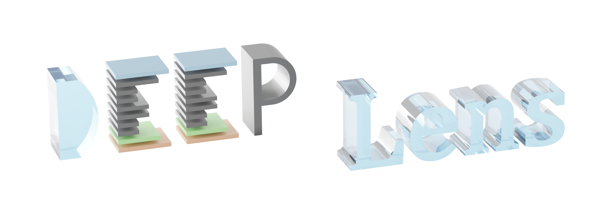
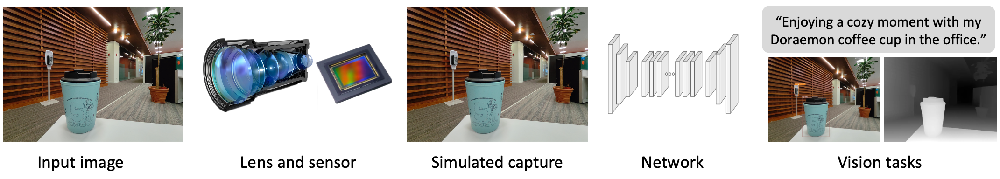
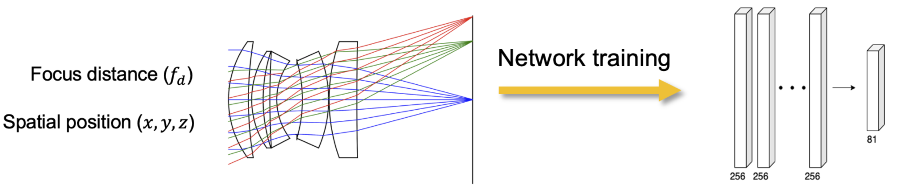
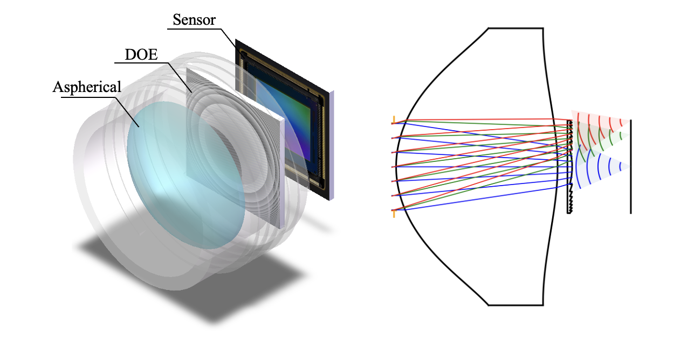

<div style="text-align:center;">
    
</div>

<p align="center">
    <a href="https://deeplens.readthedocs.io/">Docs</a> •
    <a href="https://github.com/singer-yang/DeepLens-tutorials">Tutorials</a> •
    <a href="#community">Community</a> •
    <a href="https://pypi.org/project/deeplens-core/">PyPI</a>
</p>

**DeepLens** is a differentiable optical lens simulator. It is developed for (1) differentiable optical design, (2) end-to-end optics-vision co-design, and (3) photorealistic image simulation. DeepLens helps researchers build custom differentiable optical systems and computational imaging pipelines with minimal effort.

## Mission

1. Next-generation **optical design software** enhanced by differentiable optimization.
2. Next-generation **computational cameras** integrating optical encoding with deep learning decoding.

## Features

1. **Differentiable Optics.** DeepLens leverages gradient backpropagation and differentiable optimization, demonstrating outstanding optimization power compared to classical optical design.
2. **Automated Lens Design.** Enables automated lens design using curriculum learning, optical regularization losses, and GPU acceleration.
3. **Hybrid Refractive-Diffractive Optics.** Supports accurate simulation and optimization of hybrid refractive-diffractive lenses (e.g., DOEs, metasurfaces).
4. **Accurate Image Simulation.** Delivers photorealistic, spatially-varying image simulations, verified against commercial software and real-world experiments.
5. **Optics-Vision Co-Design.** Supports end-to-end differentiability from optics, sensor, and ISP to vision algorithms, enabling comprehensive optics-vision co-design.

Additional features (available via collaboration):

1. **Polarization Ray Tracing.** Provides polarization ray tracing and differentiable optimization of coating films.
2. **Non-Sequential Ray Tracing.** Includes a differentiable non-sequential ray tracing model for stray light analysis and optimization.
3. **Kernel Acceleration.** Achieves >10x speedup and >90% GPU memory reduction with custom GPU kernels across NVIDIA and AMD platforms.
4. **Distributed Optimization.** Supports distributed simulation and optimization for billions of rays and high-resolution (>100k x 100k) diffractive computations.

## Applications

#### 1. Automated lens design

Fully automated lens design from scratch. Try it with [AutoLens](https://github.com/vccimaging/AutoLens)!

[](https://www.nature.com/articles/s41467-024-50835-7) [](https://github.com/vccimaging/AutoLens)

<div align="center">
    
    
</div>

#### 2. End-to-End lens design

Lens-network co-design from scratch using final images (or classification/detection/segmentation) as objective.

[](https://www.nature.com/articles/s41467-024-50835-7)

<div align="center">
    
</div>

#### 3. Implicit Lens Representation

A surrogate network for fast (aberration + defocus) image simulation.

[](https://ieeexplore.ieee.org/document/10209238) [](https://github.com/vccimaging/Aberration-Aware-Depth-from-Focus)

<div align="center">
    
</div>

#### 4. Hybrid Refractive-Difractive Lens Model

Design hybrid refractive-diffractive lenses with a new ray-wave model.

[](https://arxiv.org/abs/2406.00834)

<div align="center">
    
</div>

## Installation

Clone this repo:

```
git clone https://github.com/singer-yang/DeepLens
cd DeepLens
```

Create a conda environment:
```
conda create -n deeplens_env python=3.12
conda activate deeplens_env

# Linux and Mac
pip install torch torchvision
# Windows
pip install torch torchvision --index-url https://download.pytorch.org/whl/cu128

pip install -r requirements.txt
```
or
```
conda env create -f environment.yml -n deeplens_env
```

Run the demo code:
```
python 0_hello_deeplens.py
```

DeepLens repo is structured as follows:

```
DeepLens/
│
├── deeplens/
│   ├── optics/ (optics simulation)
|   ├── sensor/ (sensor simulation)
|   ├── network/ (network architectures)
|   ├── ...
|   ├── geolens.py (refractive lens with ray tracing model)
|   ├── diffraclens.py (diffractive lens with wave optics model)
|   └── your_own_optical_system.py (your own optical lens)
│
├── 0_hello_deeplens.py (code tutorials)
├── ...
└── write_your_own_code.py
```

## Community

Join our [Slack](https://join.slack.com/t/deeplens/shared_invite/zt-2wz3x2n3b-plRqN26eDhO2IY4r_gmjOw) workspace and WeChat Group (singeryang1999) to connect with our core contributors, receive the latest industry updates, and be part of our community. For any inquiries, contact Xinge Yang (xinge.yang@kaust.edu.sa).

## Contribution

We welcome all contributions. To get started, please read our [Contributing Guide](./CONTRIBUTING.md) or check out [open questions](https://github.com/users/singer-yang/projects/2). All project participants are expected to adhere to our [Code of Conduct](./CODE_OF_CONDUCT.md). A list of contributors can be viewed in [Contributors](./CONTRIBUTORS.md) and below:

<a href="https://github.com/singer-yang/DeepLens/graphs/contributors">
  
</a>

## Citation

If you use DeepLens in your research, please cite the paper. See more in [History of DeepLens](./CITATION.md).

```bibtex
@article{yang2024curriculum,
  title={Curriculum learning for ab initio deep learned refractive optics},
  author={Yang, Xinge and Fu, Qiang and Heidrich, Wolfgang},
  journal={Nature communications},
  volume={15},
  number={1},
  pages={6572},
  year={2024},
  publisher={Nature Publishing Group UK London}
}
```