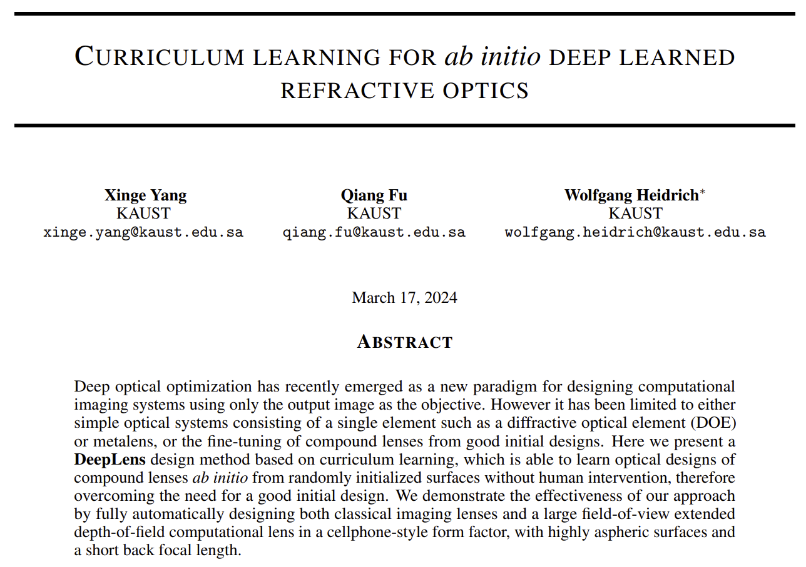
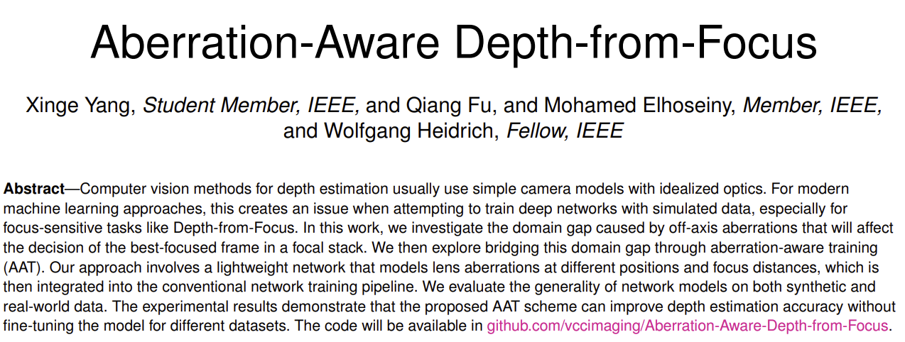

# DeepLens

DeepLens is a differentiable ray tracer for End-to-End lens design and differentiable rendering. It is first developed by [Dr. Congli Wang](https://congliwang.github.io/) (previously named **dO**), then optimized and maintained by [Xinge Yang](https://singer-yang.github.io/).

Welcome to use DeepLens in your research to (1) **build your own pipeline** or (2) **compare it as the baseline.** We can provide free code assistance if you plan to use DeepLens in your research, please contact Xinge Yang (xinge.yang@kaust.edu.sa) for more information. Lens manufacturing service is also avaliable!

### What is DeepLens

1. Deep learning **aided** lens design (gradient-based lens design)
2. Deep learning **defined** lens design (End-to-End lens design)

### Key features

1. **Outstanding optimization capabilities** (automated lens design from scratch with gradient-based optimization!)
2. **End-to-End optical design** (design your computational lens with 5 lines of code!)
3. **Memory-efficient differentiable ray-tracing** (million-level ray-tracing on a desk-machine!)
4. **Implicit representation for camera lenses** (train a network to fast calculate the PSFs!)
5. **More features** can be obtained via request or collaboration:
   1. Hybrid ray-tracing-wave-propagation simulation and optimization.
   2. Non-sequential ray-tracing for complex systems.
   3. Billion-level ray-tracing and multi-machine parallelization.
   4. Illumination and display simulation and optimization.
   5. Non-smooth imaging process optimization.

### Applications

##### Automated lens design

Can do both spherical and aspherical lens design, here aspherical lens for demonstration. Try it at [AutoLens](https://github.com/singer-yang/AutoLens)!

<div style="text-align:center;">
    
</div>

##### End-to-End lens design in 5 lines of code

No optical prior is needed, End-to-End design with purely image reconstruction loss!

<div style="text-align:center;">
    
</div>

##### Implicit representation of a specific lens

A digit-twin network for fast (aberration + defocus) image simulation.

<div style="text-align:center;">
    
</div>


### How to use

Here are two methods to use deeplens in your research:

##### Method 1

Clone this repo and write your code inside it.

```
git clone deeplens
cd deeplens
python 0_hello_deeplens.py
python your_code.py
```

##### Method 2

Clone the repo and install deeplens as a python package.

```
git clone deeplens
pip install -e ./deeplens
```

Then in your code:

```
import deeplens
lens = deeplens.Lensgroup(filename='./lenses/cellphone80deg.json')
```

##### Directory

```
deeplens/
│
├── deeplens/
│   ├── init.py
│   └── optics.py
│
├── README.md
├── LICENSE
├── setup.py
├── requirements.txt
└── 0_hello_deeplens.py

```

### Cite:

Welcome to use DeepLens in your research to (1) **build your own pipeline** or (2) **compare it as the baseline.** If you find DeepLens helpful, please cite our papers.

For lens design and End-to-End lens design:

<div style="text-align:center;">
    
</div>

```
@article{yang2023curriculum,
  title={Curriculum learning for ab initio deep learned refractive optics},
  author={Yang, Xinge and Fu, Qiang and Heidrich, Wolfgang},
  journal={arXiv preprint arXiv:2302.01089},
  year={2023}
}
```

For PSF implicit representation:

<div style="text-align:center;">
    
</div>

```
@article{yang2023aberration,
  title={Aberration-aware depth-from-focus},
  author={Yang, Xinge and Fu, Qiang and Elhoseiny, Mohamed and Heidrich, Wolfgang},
  journal={IEEE Transactions on Pattern Analysis and Machine Intelligence},
  year={2023},
  publisher={IEEE}
}
```

#### License

`<a rel="license" href="http://creativecommons.org/licenses/by-nc/4.0/">``</a><br />`This work is licensed under a `<a rel="license" href="http://creativecommons.org/licenses/by-nc/4.0/">`Creative Commons Attribution-NonCommercial 4.0 International License `</a>`.
