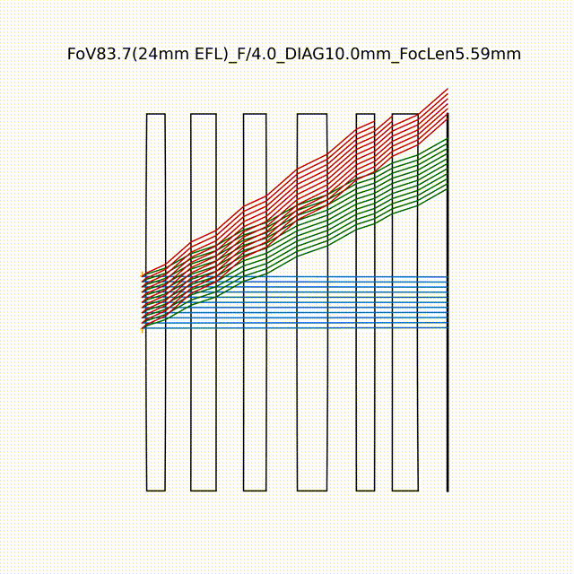
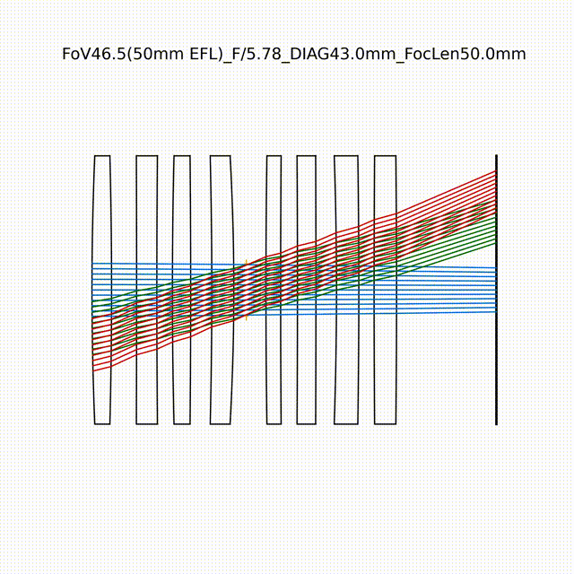
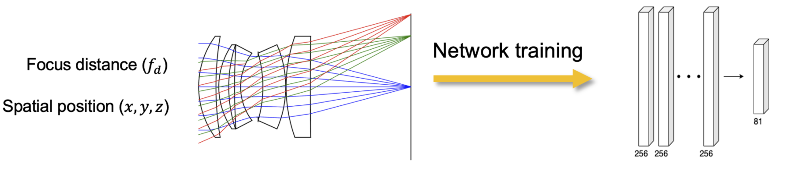
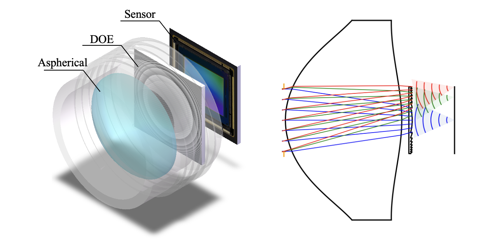

<div style="text-align:center;">
    
</div>

**DeepLens** is an open-source differentiable lens simulator. It is designed for automated optical design and end-to-end optics-sensor-network optimization. DeepLens helps researchers build custom differentiable optical systems and computational imaging pipelines with minimal effort.

## Contact

* Welcome to contribute to DeepLens! If you don't know where to start, check out some [open questions](https://github.com/users/singer-yang/projects/2).
* Contact Xinge Yang (xinge.yang@kaust.edu.sa) for any inquiries. DeepLens is also looking for sponsors!
* We have a [Slack group](https://join.slack.com/t/deeplens/shared_invite/zt-2wz3x2n3b-plRqN26eDhO2IY4r_gmjOw) and a WeChat group (add singeryang1999 to join) for discussion.
* The DeepLens paper is published in [Nature Communications](https://www.nature.com/articles/s41467-024-50835-7)!

## What is DeepLens

DeepLens combines **deep learning** and **optical design** for:

1. More powerful **optical design algorithms** enhanced by deep learning.
2. Next-generation **computational cameras** integrating optical encoding with deep learning decoding.

## Key Features

DeepLens differs from other optical software in:

1. **Differentiable** design with outstanding optimization capabilities.
2. **Open-source** optical simulator (ray-tracing, wave optics) with validated accuracy.
3. **End-to-end imaging** with sensor and image signal processing (ISP) simulation.
4. **GPU parallelization** with customized core functions.

Additional features:

1. **Physical optics** simulations including polarization tracing and film design.
2. **Complex optical systems** including non-sequential and non-coaxial optics.
3. **Neural representations** for efficient implicit optical models.
4. **Faster and better efficience** through GPU kernel customization.
5. **Large-scale** optimization with multi-machine distribution.

## Applications

#### 1. Automated lens design

Fully automated lens design from scratch. Try it with [AutoLens](https://github.com/vccimaging/AutoLens)!

[](https://www.nature.com/articles/s41467-024-50835-7) [](https://github.com/vccimaging/AutoLens)

<div align="center">
    
    
</div>

#### 2. End-to-End lens design

Lens-network co-design from scratch using final images (or classification/detection/segmentation) as objective.

[](https://www.nature.com/articles/s41467-024-50835-7)

<div align="center">
    
</div>

#### 3. Implicit Lens Representation

A surrogate network for fast (aberration + defocus) image simulation.

[](https://ieeexplore.ieee.org/document/10209238) [](https://github.com/vccimaging/Aberration-Aware-Depth-from-Focus)

<div align="center">
    
</div>

#### 4. Hybrid Refractive-Difractive Lens Model

Design hybrid refractive-diffractive lenses with a new ray-wave model.

[](https://arxiv.org/abs/2406.00834)

<div align="center">
    
</div>

## How to use

We recommend cloning this repository and writing your code directly within it:

```
git clone deeplens
cd deeplens

conda env create -f environment.yml -n deeplens

python 0_hello_deeplens.py
python your_optical_design_pipeline.py
```

DeepLens repo is structured as follows:

```
DeepLens/
│
├── deeplens/
│   ├── optics/ (optics simulation)
|   ├── sensor/ (sensor simulation)
|   ├── network/ (network architectures)
|   ├── ...
|   ├── geolens.py (refractive lens system using ray tracing)
|   ├── diffraclens.py (diffractive lens system using wave optics)
|   └── your_own_optical_system.py (your own optical system)
│
├── 0_hello_deeplens.py (code tutorials)
├── ...
└── your_optical_design_pipeline.py (your own optical design pipeline)
```

## Reference

This code is first developed by [Dr. Congli Wang](https://congliwang.github.io/) (previously named **dO**), then developed (currently named **DeepLens**) and maintained by [Xinge Yang](https://singer-yang.github.io/). 

If you use DeepLens in your research, please cite the corresponding papers:

- [TCI 2022] dO: A differentiable engine for deep lens design of computational imaging systems. [Paper](https://ieeexplore.ieee.org/document/9919421), [BibTex](./misc/do_bibtex.txt)
- [NatComm 2024] Curriculum Learning for ab initio Deep Learned Refractive Optics. [Paper](https://www.nature.com/articles/s41467-024-50835-7), [BibTex](./misc/deeplens_bibtex.txt)
- [SiggraphAsia 2024] End-to-End Hybrid Refractive-Diffractive Lens Design with Differentiable Ray-Wave Model. [Paper](https://arxiv.org/abs/2406.00834), [BibTex](./misc/hybridlens_bibtex.txt)
